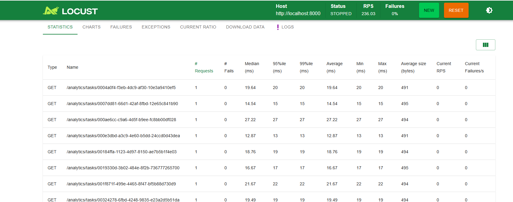
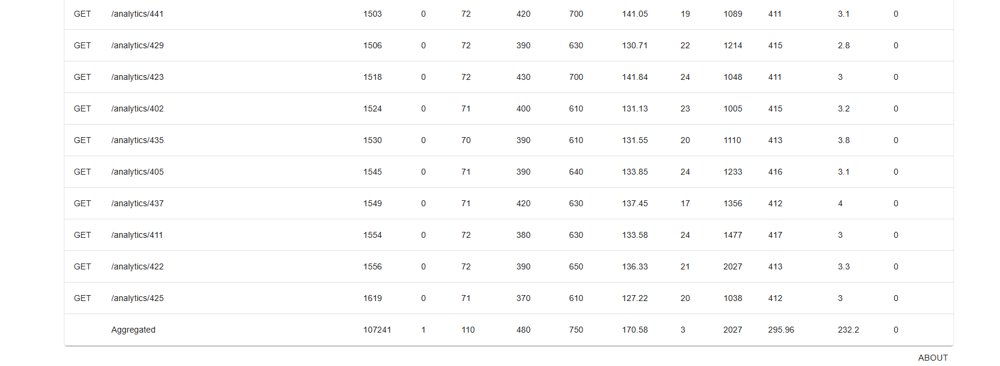

# Device Statistics Service

Сервис для сбора и анализа показателей с устройств. Принимает измерения в формате `{x, y, z}`, сохраняет их в БД и предоставляет статистику по каждому устройству.

## Стек

- **Python 3.13** / **FastAPI** — REST API
- **PostgreSQL** + **SQLAlchemy** (asyncpg) — хранение данных
- **Celery** + **Redis** — асинхронный расчёт аналитики
- **Alembic** — миграции БД
- **Docker** + **Docker Compose** — контейнеризация
- **Locust** — нагрузочное тестирование
- **Ruff** — линтер и форматировщик

## Быстрый старт

```bash
# 1. Создать внешнюю сеть (если ещё не создана)
docker network create myNetwork

# 2. Запустить PostgreSQL
docker run --name device_stats_db \
    -p 5432:5432 \
    -e POSTGRES_USER=postgres \
    -e POSTGRES_PASSWORD=example \
    -e POSTGRES_DB=stats \
    --network=myNetwork \
    --volume pg_device_stats_data:/var/lib/postgresql/data \
    -d postgres:16

# 3. Запустить Redis
docker run --name device_stats_redis \
    -p 6379:6379 \
    --network=myNetwork \
    -d redis:7.4

# 4. Заполнить переменные окружения
cp .env-example .env-local

# 5. Запустить сервис
docker-compose up --build -d
```

Сервис будет доступен на `http://localhost:8000`.  
Swagger UI: `http://localhost:8000/docs`

## Переменные окружения

| Переменная   | Описание          |
|--------------|-------------------|
| `DB_USER`    | Пользователь БД   |
| `DB_PASS`    | Пароль БД         |
| `DB_HOST`    | Хост БД           |
| `DB_PORT`    | Порт БД           |
| `DB_NAME`    | Имя БД            |
| `REDIS_HOST` | Хост Redis        |
| `REDIS_PORT` | Порт Redis        |

## API

### Пользователи и устройства

| Метод  | Путь            | Описание                    |
|--------|-----------------|-----------------------------|
| `POST` | `/users`        | Создать пользователя        |
| `POST` | `/devices`      | Зарегистрировать устройство |
| `GET`  | `/devices/{id}` | Получить устройство по ID   |

### Измерения

| Метод  | Путь                        | Описание           |
|--------|-----------------------------|--------------------|
| `POST` | `/measurements/{device_id}` | Записать измерение |

Тело запроса:
```json
{"x": 1.23, "y": -4.56, "z": 7.89}
```

### Аналитика

| Метод | Путь                           | Описание                                               |
|-------|--------------------------------|--------------------------------------------------------|
| `GET` | `/analytics/{device_id}`       | Статистика по устройству (опц. `date_from`, `date_to`) |
| `GET` | `/analytics/users/{user_id}`   | Агрегированная статистика + по каждому устройству      |
| `GET` | `/analytics/{device_id}/async` | Запуск асинхронного расчёта через Celery               |
| `GET` | `/analytics/tasks/{task_id}`   | Получение результата задачи                            |

Пример ответа `/analytics/{device_id}`:
```json
{
  "device_id": 1,
  "x": {"min_value": -99.5, "max_value": 198.2, "count": 500, "total": 12500.0, "median": 45.3},
  "y": {"min_value": -87.1, "max_value": 195.6, "count": 500, "total": 11800.0, "median": 41.7},
  "z": {"min_value": -91.3, "max_value": 197.4, "count": 500, "total": 13100.0, "median": 48.9}
}
```

По каждой оси рассчитываются: **min**, **max**, **count**, **sum**, **медиана**.

### Асинхронный режим

```
# 1. Запустить задачу
GET /analytics/42/async
-> {"task_id": "abc-123"}

# 2. Опрашивать до получения результата
GET /analytics/tasks/abc-123
-> {"status": "SUCCESS", "result": {...}}
```

## Архитектура

**Синхронный flow:**

```
HTTP Request
      |
      v
+----------------------+
|      API Layer       |  FastAPI routers
|     (src/api/)       |
+----------------------+
      |
      v
+----------------------+
|    Service Layer     |  Бизнес-логика
|   (src/services/)    |
+----------------------+
      |
      v
+----------------------+
|   Repository Layer   |  SQL-запросы через SQLAlchemy (async)
| (src/repositories/)  |
+----------------------+
      |
      v
+----------------------+
|     Data Mapper      |  ORM-модель -> Pydantic-схема
|     (mappers/)       |
+----------------------+
      |
      v
+----------------------+
|      PostgreSQL      |
+----------------------+
```


## Нагрузочное тестирование

Тестирование проводилось через Locust. Скрипт: [`tests/locustfile.py`](tests/locustfile.py).

Запуск:
```
locust -f tests/locustfile.py --host=http://localhost:8000 --web-port=8090
```

### Сценарии

| Класс                | Вес | Сценарий                                   |
|----------------------|-----|--------------------------------------------|
| `WriteUser`          | 5   | POST измерений (`/measurements/{id}`)      |
| `ReadUser`           | 3   | GET аналитики с периодом и без, по user_id |
| `AsyncAnalyticsUser` | 2   | Запуск задачи Celery + поллинг результата  |

### Результаты

Общая статистика по всем эндпоинтам:



Детализация по аналитике и строка Aggregated:



| Метрика            | Значение     |
|--------------------|--------------|
| Всего запросов     | 107 241      |
| Ошибок             | 1 (< 0.001%) |
| RPS (пик)          | 236.03       |
| Медиана (агрег.)   | 110 мс       |
| 95%ile (агрег.)    | 480 мс       |
| 99%ile (агрег.)    | 750 мс       |
| Мин. время ответа  | 3 мс         |
| Макс. время ответа | 2027 мс      |

Синхронные запросы к аналитике показали медиану **71–73 мс** при ~1500 запросов на эндпоинт. Асинхронный поллинг через Celery — **10–27 мс**.

## Структура проекта

```
device-stats/
├── src/
│   ├── api/             # FastAPI роутеры
│   ├── migrations/      # Alembic миграции
│   ├── models/          # SQLAlchemy ORM модели
│   ├── repositories/    # Слой доступа к данным
│   ├── schemas/         # Pydantic схемы
│   ├── services/        # Бизнес-логика
│   ├── tasks/           # Celery задачи
│   ├── utils/           # Исключения, DBManager
│   ├── config.py
│   ├── database.py
│   └── main.py
├── tests/
│   ├── results/         # Скриншоты нагрузочного тестирования
│   └── locustfile.py
├── .env-example
├── .gitignore
├── alembic.ini
├── docker-compose.yml
├── Dockerfile
├── poetry.lock
├── pyproject.toml
├── requirements.txt
└── README.md
```
